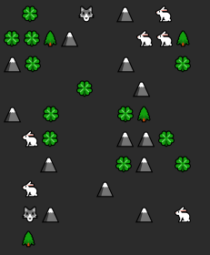

# Simulation Project

Welcome to the Simulation project of the Java Backend Learning Course. This project is a step-by-step simulation of a 2D world populated with herbivores, predators, grass, rocks, and trees. The simulation demonstrates principles of object-oriented design and architecture in Java.




## Table of Contents
- [Project Overview](#project-overview)
    - [Entities](#entities)
    - [Simulation Components](#simulation-components)
- [Getting Started](#getting-started)
- [Project Structure](#project-structure)
- [Additional Notes](#additional-notes)
- [Credits and Acknowledgments](#credits-and-acknowledgments)

## Project Overview

The simulation takes place on a 2D grid represented by an NxM matrix. The entities in the world include creatures (herbivores and predators), resources (grass), and static objects (rocks and trees). The creatures interact with each other and the environment based on their characteristics and behaviors.

### Entities

- **Entity:** Abstract class serving as the base class for all creatures and objects in the simulation.

- **Grass, Rock, Tree:** Static objects in the world. Grass serves as a resource for herbivores.

- **Creature:** Abstract class extending Entity. Represents living creatures with attributes such as speed, health points (HP), and an abstract method `makeMove()` that each creature type implements differently.

    - **Herbivore:** Creature subclass representing herbivores. Herbivores seek resources (grass) and can spend their turn moving towards or consuming grass.

    - **Predator:** Creature subclass representing predators. In addition to Creature attributes, predators have an attack power. Predators can spend their turn moving or attacking herbivores. If a predator's attack reduces an herbivore's HP to zero, the herbivore disappears.

### Simulation Components

- **Map:** Represents the grid, storing entities and their positions. Utilizes collections for entity storage.

- **Simulation:** Main class of the application, including the map, turn counter, field renderer, and actions list. Provides methods for simulating turns and managing the simulation state.

- **Actions:** Classes representing actions performed in the simulation. Two arrays, `initActions` and `turnActions`, contain actions executed before the simulation starts and on each turn, respectively.

## Getting Started

1. **Clone the Repository:**
   ```bash
   git clone https://github.com/Jurdio/pet-project-02-simulation.git
